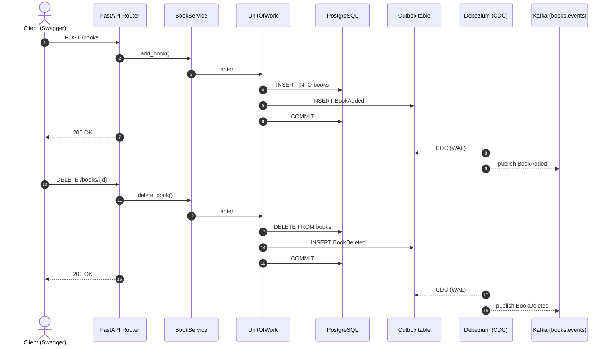
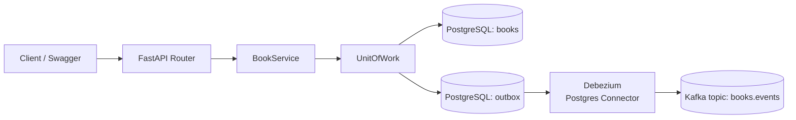

# Архитектура и Flow

Ниже описан полный поток обработки команд добавления и удаления книги  
с использованием **Unit of Work + Outbox + Debezium (CDC) + Kafka**.

---

## Sequence Diagram — Command Flow

## Flowchart — Component Map

